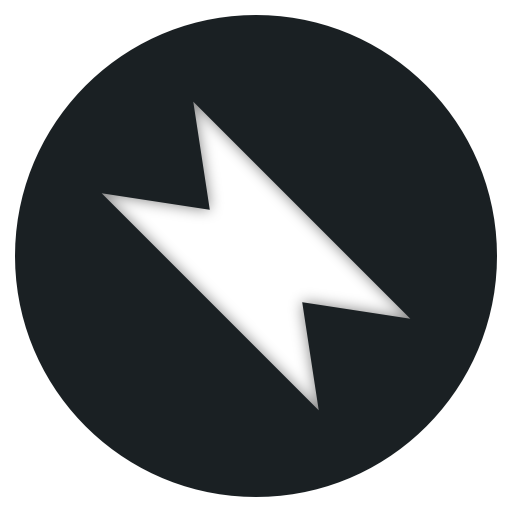

<p align="center">
  
</p>
<h1 align="center" style="margin-top:0px">
  YouTube Email Notifier
</h1>
<p align="center">macOS menubar app that emails you YouTube upload notifications</p>

## Dev instructions

### Get started

1. Install [Node.js](https://nodejs.org) (Preferably Node.js 12 because later versions result in larger binaries)
2. Run `npm install`

Start:

```sh
npm run start
```

Build:

```sh
npm run build
```
